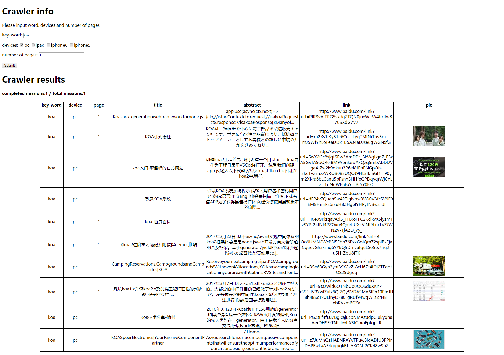

# 网页抓取分析服务
IFE 2017

### 功能：
依据输入的关键词、设备名称、指定页码数，来爬取百度搜索结果，存储到数据库中，并以列表的形式呈现到页面。

### 特点：
* 客户端-服务器通信使用stocket.io通信
* 服务器使用async控制并发，保证最多有五个抓取任务同时进行

### 项目依赖：
后端：
* koa
* koa-router
* koa-static
* koa-views
* mongoose
* phantom
* socket.io
* async

前端：
* socket.io-client

### 项目界面：
